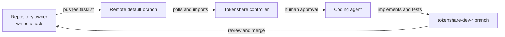

<div align="center">

# Tokenshare

### Share the task. Keep control of the agent.

An approval-gated controller that turns tasks published in Git repositories into isolated, agent-built review branches.

[](LICENSE)
[](https://www.python.org/)
[](https://github.com/ai-lchemy/tokenshare/releases)
[](https://github.com/ai-lchemy/tokenshare/discussions)

[Why Tokenshare?](#why-tokenshare) · [Quick start](#quick-start) · [Write a task](#write-a-task) · [How it works](#how-it-works) · [Security](#security)

</div>

Tokenshare connects people who define work with people who own coding-agent infrastructure. A repository owner publishes a decision-complete task. An agent owner reviews it, approves it, and lets Tokenshare run the work in their own environment. The result is pushed to a dedicated branch for normal code review—never directly to the default branch.

> [!WARNING]
> Tokenshare is a controller, not a sandbox. Agents inherit the controller user's permissions, credentials, environment, and network access. Review every task and run Tokenshare in a secure, disposable VM with appropriate isolation.

## Why Tokenshare?

- Coding agent API prices are expensive yet the vast majority of consumers with monthly AI subscriptions struggle to use all their tokens.
- Open source repos (especially small ones) do not have very much money to afford said coding agents, but they do have a vision for a real world product that will solve a problem.
- My dream for tokenshare is to provide a means for open source developers to connect with and receive assistance through their supporters in order to make more and higher quality open source software for the world.

## How it works

Coding agents are good at implementation, but handing work between repositories, people, and machines still takes coordination. Tokenshare makes that handoff a versioned Git workflow.

- **Git is the inbox.** Repository owners publish tasks in a small Markdown tasklist.
- **Humans approve execution.** Newly discovered tasks cannot run until the agent owner approves them.
- **Agents work unattended.** The controller handles cloning, branching, retries, session resume, commits, and pushes.
- **Review stays familiar.** Each result lands on a `tokenshare-dev-...` branch, ready for a pull request.
- **Execution stays local.** The agent owner chooses the machine, workspace, agent command, credentials, and concurrency.



1. A repository contains exactly one `tokenshare_tasklist.md`, at its root or in `docs/`.
2. The controller imports new Pending tasks as **Unapproved** snapshots.
3. The agent owner inspects and approves selected tasks in the terminal UI.
4. Tokenshare creates a branch from the remote default branch and moves the task through Pending → WIP → Done.
5. The selected coding agent implements and tests the task. Tokenshare commits and pushes the result for review.

Tokenshare never pushes to, merges, or deletes the remote default branch.

## Quick start

### Requirements

- Python 3
- Git credentials that can clone, pull, and push the configured repositories
- A supported coding agent on `PATH`—Codex is the default; Claude Code and OpenCode are also recognized
- tmux for the default detached-agent workflow

### 1. Install

```bash
git clone https://github.com/ai-lchemy/tokenshare.git
cd tokenshare
python3 install.py
```

The installer asks where task repositories should be cloned (default: `~/tokenshare_dev`). It installs:

- `tokenshare-controller` into `~/.local/bin`
- the Tokenshare skill for Codex, Claude Code, and OpenCode
- installation metadata into `~/.config/tokenshare/install.json`

Make sure `~/.local/bin` is on your `PATH`. To choose the workspace noninteractively:

```bash
python3 install.py --development-directory /absolute/path/to/tokenshare_dev
```

### 2. Add repositories

Edit `config/task_repos.md` and add one accessible Git URL per line:

```text
https://github.com/example/project-one.git
git@github.com:example/project-two.git
```

Each repository must contain exactly one `tokenshare_tasklist.md` at the repository root or under `docs/`.

### 3. Start the controller

```bash
tokenshare-controller
```

Review the imported tasks, then approve only the ones you trust:

```text
view
approve 1,3
approve 5:8
approve all not 2,4
help
quit
```

Approval numbers are temporary and apply only to Unapproved tasks. The remaining queue is renumbered after every approval.

## Write a task

Repository owners do not need to run the controller. Add this file to the repository, complete the task, and push it through the normal Git workflow:

```markdown
# Tokenshare Tasklist

## Configuration

allow-multiple-branches: false

## Pending Tasks

### <task> [Pending] Concise Unique Title

#### Objective

Describe the intended outcome and why it matters.

#### Requirements

- State decision-complete functional and technical requirements.
- Include relevant constraints, interfaces, edge cases, and failure behavior.

#### Validation

- State exact tests and observable acceptance criteria.

#### Out of scope

- Record important exclusions when needed.

### </task>

## WIP Tasks

## Completed Tasks
```

Keep section names and task states exact. Task titles must be unique across Pending, WIP, and Completed sections. Changing or removing an unstarted remote task invalidates its previous snapshot and requires fresh approval.

### Author tasks with the skill

The optional Tokenshare skill can inspect a repository, draft a decision-complete task, or challenge an existing one. Use it in Plan mode:

```text
/plan $tokenshare -ct Add the task idea here
/plan $tokenshare -gt Exact Existing Task Title
```

`-ct/--create-task` proposes a new Pending task. `-gt/--grill-task` finds ambiguity and refines an existing local Pending task. After explicit approval in execution mode, the skill edits only the local tasklist—it never commits or pushes.

## Controller guide

### Useful modes

```bash
# Synchronize repositories, finish already-approved work, then exit
tokenshare-controller --non-interactive-mode

# Run up to four repositories concurrently (one task at a time per repository)
tokenshare-controller --workers 4

# Use a bundled agent stub
tokenshare-controller --agent codex-gpt-56-sol

# Supply a custom native agent command
tokenshare-controller --agent-command "claude"
```

`allow-multiple-branches: true` permits another task to be published while an earlier review branch remains unmerged.

> [!CAUTION]
> `--dangerously-skip-approvals` runs imported tasks immediately. Use it only when every task is authored and trusted by the agent owner.

`--clear-history` clears controller state, intake history, and repository task logs. It does not alter repositories, remote branches, or the controller audit log.

### Watch agent sessions

Agents run in detached tmux sessions by default. To watch them automatically, open a separate terminal:

```bash
tmux new-session -A -s tokenshare-viewer
tty
```

Then pass the printed TTY path to the controller:

```bash
tokenshare-controller --auto-attach /dev/pts/9
```

Use tmux copy mode to inspect output (`q` exits copy mode) or `Ctrl-b d` to detach without stopping the agent. Plain-shell TTYs and the controller's own TTY are rejected.

### Logs and state

Durable logs stay outside monitored repositories:

```text
<workspace>/logs/agent/tokenshare-controller.log
<workspace>/logs/agent/tokenshare_agent_tasklist.md
<workspace>/logs/repos/<task-branch>_log.md
~/.config/tokenshare/state.json
```

Failed agent sessions retry with incremental backoff and resume native sessions when supported.

## Configuration reference

Command-line flags override environment variables. Run `tokenshare-controller --help` for the complete CLI reference.

| Environment variable | Default | Purpose |
| --- | --- | --- |
| `TOKENSHARE_CONFIG` | `<installation>/config/task_repos.md` | Repository-list path |
| `TOKENSHARE_WORKSPACE` | Installed development directory | Clone parent and log directory |
| `TOKENSHARE_AGENT_COMMAND` | `codex --dangerously-bypass-approvals-and-sandbox` | Native agent command |
| `TOKENSHARE_AGENT` | unset | Agent stub name or path |
| `TOKENSHARE_POLL_SECONDS` | `60` | Remote polling interval |
| `TOKENSHARE_WORKERS` | `1` | Maximum concurrent repositories |
| `TOKENSHARE_AUTO_ATTACH` | unset | Automatic viewer TTY |
| `TOKENSHARE_STATE` | `~/.config/tokenshare/state.json` | Controller state path |

## Security

The remote tasklist is the trust boundary. A repository owner can place arbitrary instructions in a task, and the coding agent can use everything available to the controller process.

- Inspect imported task snapshots before approval.
- Use a disposable VM or equivalent isolation.
- Provide only the credentials and network access required for the job.
- Treat `--dangerously-skip-approvals` as trusted-input-only.
- Send incomplete or ambiguous tasks back to the repository owner instead of silently rewriting their intent.

Tokenshare stops on inaccessible repositories, conflicting tasklists, remote-default-branch WIP tasks, and unrelated dirty working trees. These checks reduce accidental damage; they do not create a security sandbox.

## Development

Run the test suite and syntax check from the repository root:

```bash
python3 -m unittest discover -s tests -p "test_*.py"
python3 -m py_compile scripts/tokenshare-controller.py
```

## License

Tokenshare is available under the [MIT License](LICENSE).
